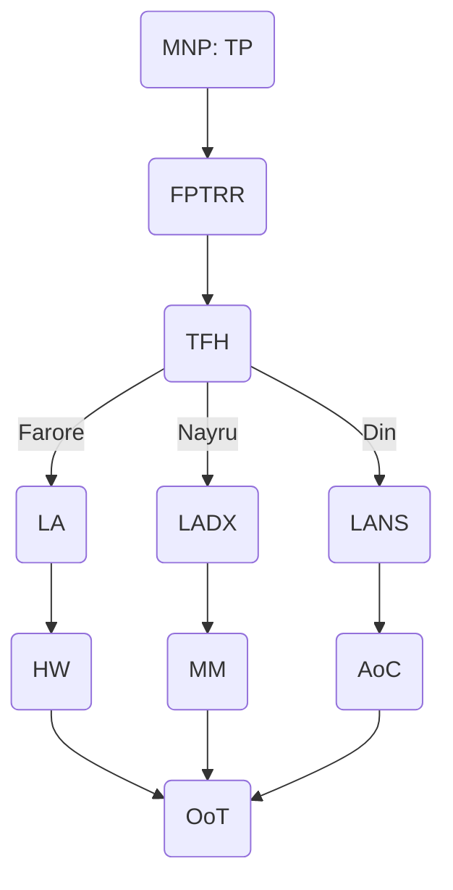

```mermaid
flowchart TD
    g1(MNP: TP)-->g2(FPTRR)
    g2-->g3(TFH)
    g3-->|Farore|g4a(LA)
    g3-->|Nayru|g4b(LADX)
    g3-->|Din|g4c(LANS)
    g4a-->g5a(HW)
    g4b-->g5b(MM)
    g4c-->g5c(AoC)
    g6(OoT)
    g5a-->g6
    g5b-->g6
    g5c-->g6
```